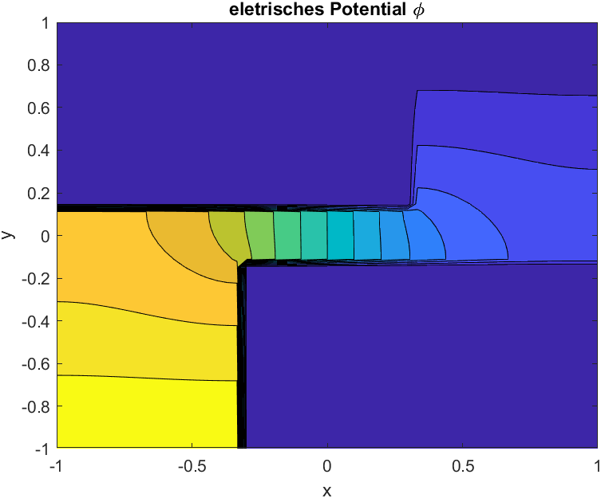
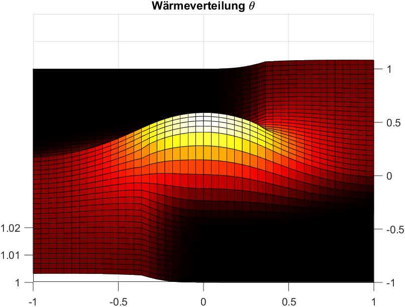

                            
# Multiphysics Code

This repo contains matlab code for multiphysics simulations. The folder ``electro-thermal`` contains an example for the Cell method coupling of stationary currents and
thermal propagation.

## Electro-Thermal

Calculation of the electric scalar Potential:

 

and the stationary current densities:

Coupling via power loss in the dual grid cells yields the thermal solution:

