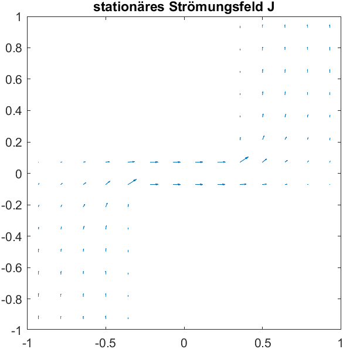
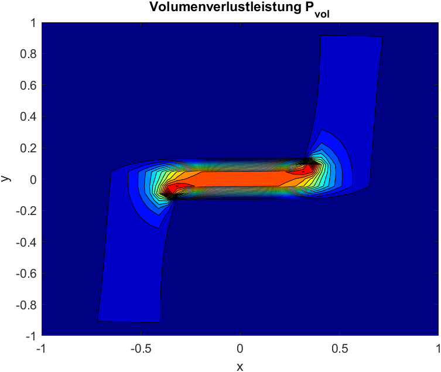

                            
# Multiphysics Code

This repo contains matlab code for multiphysics simulations. The folder ``electro-thermal`` contains an example for the Cell method coupling of stationary currents and
thermal propagation.

## Electro-Thermal

# The electromagnetic solution first

Calculation of the electric scalar Potential:

 

and the stationary current densities:

# Thermal coupling

Coupling via power loss over the primal-edges/dual-surfaces:

Solving the thermal problem with powerloss as right hand side

ToDo: find error in thermal system ...